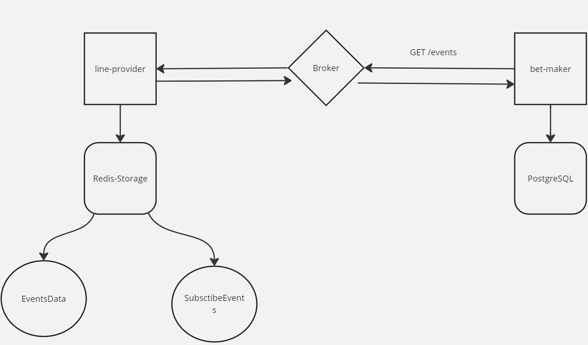

# Тестовое задание. Event Walker

## Задача: Разработать два независимых сервиса line-provider и bet-maker, которые будут обмениваться между собой событиями

Стэк: 
<div>
  &nbsp;
  &nbsp;
  &nbsp;
  &nbsp;
  &nbsp;
  &nbsp;
</div>

____

## API
### line-provider:
`POST /event`

*Создать новый эвент*

> Пример запроса в ручку

> 200 Response

```json
[
  {
    "event_id": "string",
    "ratio": 1.0,
    "deadline": 1.0,
    "status": "string"
  }
]
```
`PUT /event`

*Обновить событие*

> Пример запроса в ручку

> 201 Response

```json
[
  {
    "event_id": "string",
    "ratio": 1.0,
    "deadline": 1.0,
    "status": "string"
  }
]
```

> Пример ответа ручки

```json
[
  {
    "event_id": "string",
    "status": "string"
  }
]
```
___

### bet-maker
`GET /events`

*Получить эвенты*

> Пример ответа ручки

> 200 Response

```json
[
  {
    "event_id": "string",
    "ratio": 1.0,
    "deadline": 1.0,
    "status": "string"
  }
]
```
`GET /bets`

*Получить историю ставок*

> Пример ответа ручки

> 200 Response

```json
[
  {
    "event_id": "string",
    "sum_bet": 1.0,
    "status": "string"
  }
]
```

`POST /bet`

*Создать ставку*

> Пример запроса в ручку

> 200 Response

```json
[
  {
    "event_id": "string",
    "sum_bet": 1.0
  }
]
```
> Пример ответа ручки

```json
[
  {
    "event_id": "string",
    "sum_bet": 1.0,
    "status": "string"
  }
]
```

## Принцип работы: 
### Сервисы взаимодействубт между собой через брокер сообщений RabbitMQ, когда дергается ручка get_events, создается событие и публикуется в очередь, консюмер line-provider читает его и реагирует на него, когда создается ставка в этом момент публикуется событие, где `event_id` является событие на эвент, подписки храняться в отдельном хранилище Redis, когда событие обновляется то эвент с таким то event_id был обновлен, и те кто подписался получат это обновление.


___

## Руководство по запуску:
### Выполните команду `docker-compose up -d --build`
### После этого сервисы станут доступны по адресу [localhost:8000](http://localhost:8000) и [localhost:8001](http://localhost:8001)

___
## Тесты
### Для запуска тестов нужно поднять тестовую инфраструктуру - это можно сделать с помощью команды `docker-compose up -d`, после чего будут доступны `unit` и `integration` тесты
### Команды запуска тестов:
### *line-provider*
`pytest line-provider/tests`

### *bet-maker*
`pytest bet-maker/tests`

___

## Developer: by Dr1DeX
